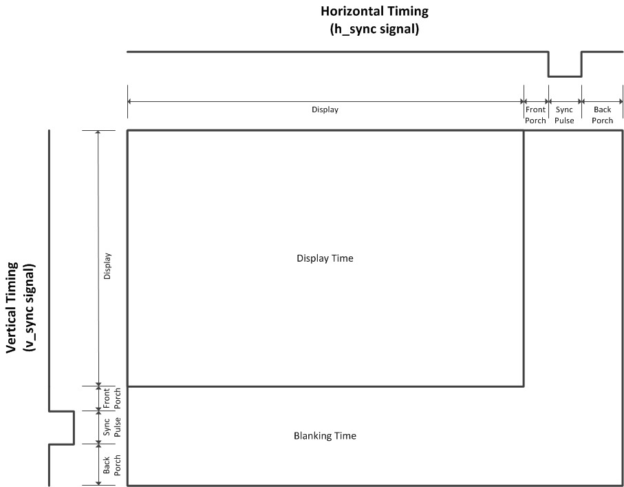
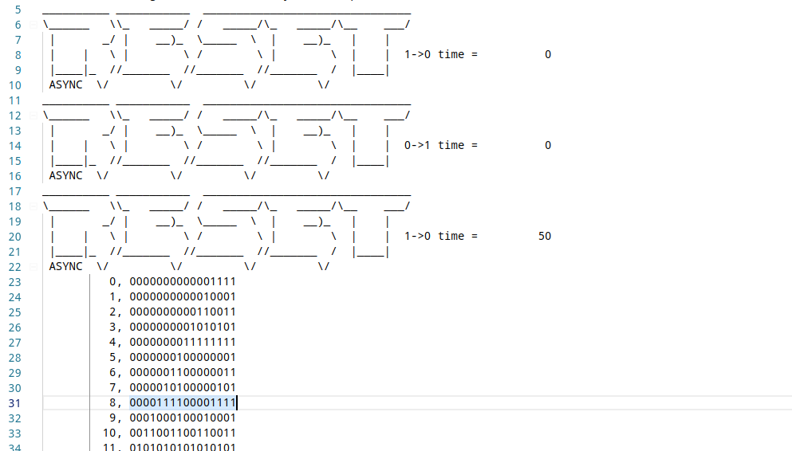
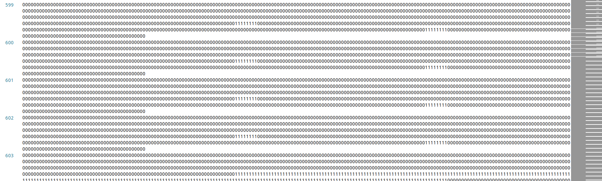
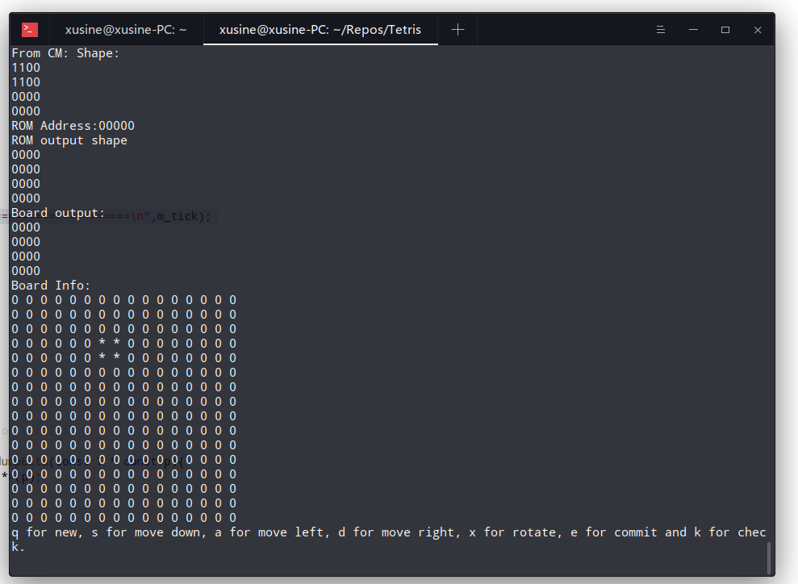
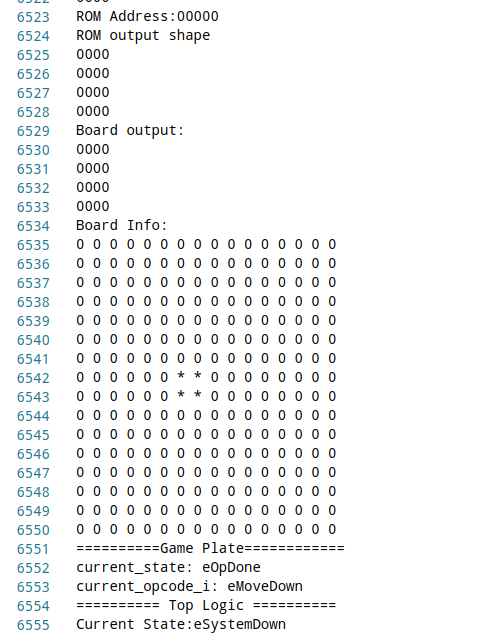
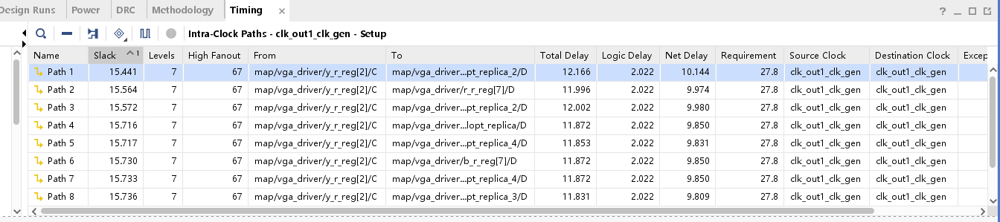
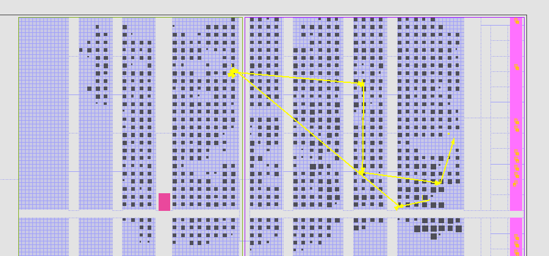

## 专用集成电路设计方法 课程报告
姓名:林山青
学号:16307130142

### 设计目标
使用FPGA设计游戏俄罗斯方块,实现最基本的功能,包括:
   * 方块的旋转和移动
   * 游戏逻辑与进程
   * VGA显示信号

由于有多种功能,因而对不同的功能设计不同的模块,然后最终组合起来形成整体的电路.

### 目录结构

目录|用途
-|-
doc|文档目录,包括所有的配图
fpga|fpga开发板的项目文件,包括vivado和quartus
include|sv的头文件,用于全局参数的定义
rom|只读存储器的配置文件
rtl|基于sv的RTL级电路文件
script|实用脚本
sim|用于vcs测试,sv编写的testbench
sim_verilator|用于verilator测试,C++编写的testbench.
Makefile|用于make的快速构建

### 设计流程与工具链



### 系统框图
系统本身的显示部分的大类是由两部分组成:
1. 后端,包括游戏的逻辑控制,游戏状态的更新.主要包括的模块有状态机FSM和更新游戏状态的执行单元Executor.
2. 前端,主要是处理输入输出功能,包括键盘的防抖动处理,VGA控制器以及布局模块.

整个系统的框架图如下,后面会对每一个模块的设计方式单独讨论:


### ROM模块说明
本小节对两个ROM进行说明,包括定义方式以及内存中结果的数据格式.
同时为了能够适用任何平台,所有的rom文件最后都被转换成了sv文件,同时也是为了软件仿真的需要.转换的脚本位于script/convert_mif_to_sv.py.
#### Tetris ROM
这个ROM的作用是存放了俄罗斯方块所有的方块信息,包括起始位置和终止位置,以方便进行后续的操作.
首先需要对块进行编码.俄罗斯方块一共有七种,其中最大的块长度为4,经过旋转之后的块长度也为4.所以统一使用4×4的内存区域进行编码,如下图所示:


其中0号块为空块,用于初始化当前状态内存.每一个4×4的矩阵都按照从左到右,从上到下的顺序进行存储.比如上图中的Type[4]的编码就为0000_0000_0011_0011.
另一方面,由于旋转的原因,屏幕的左上角很可能是空块,所以必须要记录每一个块的最大值和最小值,以方便确定块的位置.所有的块记录格式为[miny, minx, maxy, maxx, shape].

#### Character ROM

这个主要是用来存储字母和数字.所有的文字宽度为32个,高度为64个.具体是使用程序生成的,这里不进行过多的讨论.具体的文件为rom/memory_str*.sv.

### 行为模块说明
本小节对逻辑模块的行为进行讨论.其中本部分只给出了每个模块的框图和行为,暂时不给出对应实现的SystemVerilog代码.如需要参见代码的设计,请参考后续的内容.

#### Random Generator
随机数生成器采用最简单的线性反馈移位寄存器(Linear Feedback Shift Register),由于单组LFSR产生的随机程度不够大,这里使用四个不同的LSFR的输出结果的xor结果.下图给出了一种可能的配置结构:


随机数的生成实际上是冗余的.比如如果需要8位二进制数,最后的结果可能要求生成32位二进制数,然后再进行折叠xor,最终确保比较好的随机性.

#### Matrix Memory
矩阵内存本身具有两种读写口,即按照行读写或者按照4×4的块读写.其中一共有两个按行读取的口,用于扫描和检查是否能够消除时使用,还有两个给出(x,y)的地址,然后读取以这个点为左上角的4×4的方形区域.这个读口主要是用于检查移动以及旋转.
对于写入口,同样有按照行来写入和按照块来写入,分别用于扫描和块替换.


同时为了方便后文逻辑的编写,特别对块访问设置了边界检查函数,包括:
1. 如果访问的单元超过了左,右和下边界,则返回1(代表此处已经被占据了.)
2. 如果访问的单元位于[-4,0)之间,则默认返回0.因为此处是新建模块存放的位置,必须要空出.
3. 如果访问的模块位于正常的区域内,则不做任何限制.

为了方便起见,以下所有的Matrix Memory都用简称MM代替.

#### Current Tile Memory
这个模块(以下简称CM)则用于记录当前要操作的块的属性,包括:
1. 块的左上角在Matrix Memory坐标位置,横坐标取值可能取为[0,width_p],纵坐标取值可能为[-4,height_p].(二者都是在文件中定义的参数,以方便后续不同版本的验证)
2. 当前块的信息,包括块的形状,块在内存中的id.
3. 当前块的移动可行性信息,包括当前块是否可以左右以及向下移动,当然还有旋转.
4. 下一块的信息,主要用于和显示的部分对接.

这个模块还有一系列读写接口,这部分将在后续的代码说明中介绍.

#### Executor
不同的操作都有一个控制状态机与之对应.为了方便测试,每一种功能都被封装成了具有一个状态机的模块,这些模块被称之为executor.目前的程序中一共有5种executor:
1. Executor New,用于创建新的tile,主要的职责是把CM中下一块的信息搬运到当前块中,并发出更新下一块的信号.
2. Executor Move/Rotate,用于当前block的移动和旋转,主要负责更新CM中的信息.
3. Executor Commit,用于把CM中当前块的信息转移到Matrix Memory中.
4. Executor Check, 用于对Matrix Memory中的每一行进行检查,如果出现了某一行全为1的情况,则把这一行清除,并对之上的块进行搬移.

下图总结了Executor的内部电路结构,对于更加详细的结构,请参考模块的代码说明部分.


#### Game Plate
这个模块主要是把CM和MM以及所有的Executor连接起来.大致相当于系统框图中的状态机,但这个状态机本身更像一个小处理器,用于获取可以执行的"指令"然后激活相应的Executor.整个模块的模式图如下图所示:


各个Executor的状态通过一个activate的多路选择器汇总到了状态机中,然后状态机再根据这些参数进行跳转,同时更新游戏的状态,比如当前操作是否已经完成,游戏是否已经结束或者失败等.有了这个模块,游戏的基本逻辑就已经建立起来了,剩下需要的就是向这个模块发送要执行的指令了.
我用Verilator的仿真器对这个模块进行了仿真,如果单独使用这个模块也是可以进行简单的俄罗斯方块游戏的,对于具体的内容,请参考后面测试一章.

#### Game Top Logic
本来打算用logic作为模块的名字的,结果logic是sv的关键字哎,所以最后迫不得已换了这个奇怪的名字.
这个模块的作用是把一些高层次的操作(比如系统自动的下降\外界用户请求的移动和旋转)转换为Game plate能够支持的一系列指令串,同时需要向前端逻辑转发需要的信息,比如游戏当前的分数,以及游戏是否结束等.实际上,整个游戏的后端都被封装到这个模块里了,也可以称之为幕后黑手~
对游戏分数的计算也是在这一部分进行的.由于数字直接相加是16进制的,因而必须要转换成10进制.为了节省除法器,模块中采用了BCD码,并且每次进行加法后都会进行十进制调整.具体的可以参见后面代码的内容.
最后,为了能和前端的模块融合,一个提供给前端扫描的端口也被暴露出来,这样只要前端提供坐标,后端就可以简单的提供数据.
同时,顶层逻辑模块还有从1MHz中分频的单元,以方便所有低速模块的驱动.(比如防抖动模块)
#### Layout Map

这个模块属于前端,主要是对不同的部件进行布局.本实验中使用的分辨率为800×600,以8*8的像素点为一个单位,则整个屏幕可以简单的划分为100×72的方阵,这里暂且称之为逻辑块.后续的布局中,所有的块都是和逻辑块对齐的.
下图是本项目的布局图:


模块内部则定义了各种坐标的偏移量,包括起始位置,终止位置等. 这些参数主要定义在include/layout_p.sv文件中.

#### VGA Controller

这个模块则主要负责VGA的扫描功能.VGA一共有5根信号线,其名字和含义分别如下:
信号名|信号含义
-|-
R|模拟信号,红色通道输出
G|模拟信号,绿色通道输出
B|模拟信号,蓝色通道输出
H_S|行同步信号,用于结束一行的渲染
V_S|场同步信号,用于结束一帧的渲染

对于不同的分辨率,不同的信号持续时间长短也不近相同.下图把VGA的信号和屏幕上扫描的位置对应起来,以便理解:



对于这些参数的查找,可以参考[这里](http://tinyvga.com/vga-timing),本设计中使用的800×600×56Hz.

### 模块代码说明
本部分介绍了模块对应的实现代码的重要思想以及状态机状态的说明.对于具体的代码,请参考源文件.

#### Style
为了增强可读性,所有的变量命名具有这样的格式:
前后缀|意义
-|-
_p|参数
_r|寄存器
_i|输入
_o|输出
_t|结构类型
_e|枚举类型
eXX|枚举值

所有的导线都不添加后缀,也没有固定的明明风格.同时对于所有的时序逻辑模块,clk_i为时钟,reset_i为同步复位高电平有效的复位信号.
如果有模块有debug_p的参数,则意味着这个模块在使用verilator/VCS仿真的时候可以输出信息.

#### Declaration
为了方便代码的实现,在include目录下的tetris.sv中声明了以下数据类型,这些属性都是全局使用的属性.
首先是操作码,这个主要是用于和game plate进行交互:
```verilog
typedef enum logic [2:0] { ... } opcode_e /*verilator public*/;
```
其取值有:
值|含义
eNop|空指令
eNew|新增加一块
eMoveLeft/Right/Down|当前块左移/右移/下移
eRotate|旋转
eCommit|提交,把当前块提交到内存中
eCheck|检查是否用某一行已满

其次定义的是块的类型,主要用于方便的从内存中取块.
```verilog
typedef enum logic [2:0] { ... } tile_type_e /*verilator public*/;
```
其具体的取值可以参考源码和内存部分.
接下来是两个类型,主要用于直对接从内存中取出的数据对应.
```verilog
typedef logic [3:0][3:0] shape_t; //块信息

typedef struct packed{
    logic [1:0] min_y_m; // 最小(第一个有格)的y坐标
    logic [1:0] min_x_m; // 最小的x坐标
    logic [1:0] max_y_m; // 最大(最远有格子)的y坐标
    logic [1:0] max_x_m; // 最大的x坐标
    shape_t shape_m; // 4×4方阵
} shape_info_t /*verilator public*/;
```
在代码中,这一部分表征的数据类型是直接从内存中取出的,因而非常方便.
由于程序中大量使用了点的信息,所以定义一个点的数据结构非常具有便利性.
```verilog
typedef struct packed{
  logic [$clog2(scene_height_p):0] y_m;
  logic [$clog2(scene_width_p):0] x_m;
} point_t /*verilator public*/;
```
由于在使用VCS/Verilator的过程会生成时序报告,所以这里设置一个可以按照低位在前的顺序打印Memory的函数,该函数不可综合,但是可以在仿真的时候调用.
```verilog
function void displayMatrix(
  input shape_t shape_i
);
  for(integer i = 0; i < 4; ++i) begin
      for(integer j = 0; j < 4; ++j)
        $write("%b",shape_i[i][j]);
      $display("");
    end
endfunction
```
对于前端,则有几个部件的布局信息,因而定义一个结构体以缩小代码规模.这些代码位于include/layout_p.sv中
```verilog
typedef struct packed{
  logic [$clog2(logic_width_p)-1:0] x_m; //左上角x坐标
  logic [$clog2(logic_height_p)-1:0] y_m; //左上角y坐标
  logic [$clog2(logic_width_p)-1:0] w_m; // 宽度
  logic [$clog2(logic_height_p)-1:0] h_m; // 高度
} rect_t;
```
其他参数的定义也位于这个文件中.

#### Random Generator / Union Random Generator

先说Random Generator.为了代码便利,模块中大量使用一个generate循环生成反馈回路.
其参数有:
* width_p: 生成随机数的宽度.通常会有大量的冗余.
* mask_p: 对于某一个bit,是否生成与第一个元素亦或的电路的.这个参数则用于方便的控制生成路径.对于具体的代码,可以参考random_generator.sv
* seed_p: 随机种子,复位的时候会被设置为该数.

Union Random Generator则是利用random_generator拼接得到的,同样使用了generate语法.不同的模块设置了不同的随机种子和mask.这样生成的随机模块更具有随机性. 在设计中遇到的最主要的问题还是无法在综合的阶段产生随机常数,这导致每次生成的位流文件中随机模块都是一样的.

#### Matrix Memory

Matrix Memory是一个仿真的SRAM数组,其宽度由参数决定.除了常规SRAM的按行读写之外,MM还有给定左上角地址读取4×4的块的功能.这个功能的实现则是用了8个加法器:
``` verilog
for(genvar i = 0; i < 4; ++i) begin
  assign read_addr_y_2[i] = read_block_addr_2_i.y_m + i;
  assign read_addr_x_2[i] = read_block_addr_2_i.x_m + i;
  for(genvar j = 0; j < 4; ++j) begin
    always_comb begin
      if(read_addr_x_2[j] >= width_p)
        read_block_data_2_o[i][j] = 1'b1;
      else if(read_addr_y_2[i] >= height_p && read_addr_y_2[i] < 2*height_p - 4)
        read_block_data_2_o[i][j] = 1'b1;
      else if(read_addr_y_2[i] >= 2*height_p - 4)
        read_block_data_2_o[i][j] = 1'b0;
      else 
        read_block_data_2_o[i][j] = 
    mem_r[read_addr_y_2[i][$clog2(height_p)-1:0]][read_addr_x_2[j][$clog2(width_p)-1:0]];
    end
  end
end
```
由于按块读取主要用于能否移动的判断,因而只要是左右出界的区域都会被赋值为1(第一行的if决定的),然后由于第一块是放在-4到0的位置,所以除了这一块区域永远是0.

所有的Memory都使用异步读同步写的方式,即读取是组合逻辑,但是写入时要等下一个时钟上升沿来临时才会被写回.这样做可以避免零延时路径的产生.

对于块写回,则需要16个周期才能完成,此时MM的状态机进入了eBLOCK的状态.这16个周期内MM不会响应外界其他的写入操作.

####　Current Tile Memory
这个模块用于记录所有和当前移动的块的信息,也是整个项目中复杂度最高的模块之一.其拥有的I/O口包括以下几组:
* 清空当前块的信息,主要用于提交阶段(Commit)
* 修改当前块的形状信息,主要用于创建和旋转当前块.
* 修改当前块的位置信息,主要用于新建和移动当前块.
* 对外输出当前块信息,包括当前块的位置,当前块的形状,下一块的位置,下一块的形状以及当前块的移动可行性,包括能否左右下移动和旋转.
每一组I/O都有valid信号.
模块本身也是一个很大的状态机,所有可能取到的状态如下:
```verilog
typedef enum bit [2:0] {eIDLE, eJudgeLeft, eJudgeRight, 
  eJudgeDown, eJudgeRotate, eSetNext} state_e;
```
大概都是见名知意的状态,而它们之间的跳转规则为:
* eIdle如果结束,意味着信息已经更新,接下来要跳转到eJudge*阶段判断移动可行性.
* eJudge*全部结束后,状态机跳转到空闲状态,等待下一次设置的输入.
* eSetNew主要用于设置下一块,通常在程序复位的时候会自动跳转到这一个状态.每次设置新块结束后顶层逻辑都会让这个模块跳转到这个状态.

#### Executor New

这个执行模块主要用于创建新块. 其I/O除了valid/done信号外,还有和CM的交互信号,包括读取CM中下一块的信息,并以此设置形状和位置.
其状态机阶段有:
```verilog
typedef enum {eIDLE, eFetch, eUpdate, eWaiting} state_t;
```
其中eFetch则主要用于根据CM提示的下一块的类型从ROM中获取信息,包括形状和边界坐标.而eUpdate阶段则是用于向CM中写入信息,而eWaiting则主要是等待CM内部就绪.
所有的新块都会被移动到横坐标为宽度的一半,纵坐标为底部最靠近上边界的位置.

#### Executor Rotate/Move

这两个模块主要进行旋转和移动的工作,由于状态机和I/O的结构非常相似,所以这里放在一起讨论.
两个模块接纳的I/O有:

* valid信号,主要是用于判断操作是否可以进行
* 与CM的交互信号,包括读写地址读写有效信号
* 当前移动是否允许的信号,其实可以归类在CM的交互信号中.

这两个模块对应的状态机为:
```verilog
typedef enum bit [1:0] {eIDLE, eWrite, eWaiting} state_e;
```
其中eWrite和Executor New中的eUpdate信号作用非常相似.由于不需要从ROM取出数据,因而也不需要eFetch阶段.

#### Executor Commit

这个模块则用于根据CM中的信息填涂MM中对应的块,然后清空CM中的信息.由于还需要和MM交互,因而和之前的执行模块相比还需要和MM交互的I/O口.
这个模块的状态机为:
```verilog
typedef enum bit [1:0] {eIDLE, eWrite, eWaiting, eEmpty} state_e;
```
其中eWrite/eWaiting不是等待CM就绪,而是等待MM就绪.而最后的eEmpty则是用于清空CM中当前块的信息,提示转移已经完成.

#### Executor Check
这个模块则用于消除MM中被填满的一行,然后循环检查.其I/O口只有和MM交互的部分,而状态机和前面的模块相比有很大的不同:
```verilog
typedef enum bit [1:0] {eIDLE, eCheck, eMove} state_e;
```
其中eCheck则是检查是否MM中有一行全为1,如果有的话,就会跳转到eMove,eMove的职责则是相当于进行了一次向下移位的搬运.在eMove结束后,状态又会跳回eCheck,用于检查可能清除的其他行信息:
```verilog
always_ff @(posedge clk_i) begin
  if(reset_i) begin
    state_r <= eIDLE; // Reset
  end
  else if(state_r == eIDLE && v_i) begin
    state_r <= eCheck; // Start checking
  end
  else if(state_r == eCheck) begin
    if(mm_read_data_i == '1) state_r <= eMove; // Move occurs.
    else if(index_addr_r == 0) state_r <= eIDLE; // No required row
  end
  else if(state_r == eMove) begin
    if(index_addr_r == 0) state_r <= eCheck; // Back to eCheck.
  end
end
```
同时由于读要被搬移行的地址之比当前写入多1,因而不需要生成两个寄存器,只要在状态跳转的时候控制好节拍,再借助一个加法器即可:
```verilog
always_ff @(posedge clk_i) begin
  //Check starts from top to bottom
  if(reset_i) index_addr_r <= height_p - 1;
  else if(state_r == eIDLE) index_addr_r <= height_p - 1;
  else if(state_r == eMove && index_addr_r == 0) index_addr_r <= height_p - 1; 
  else index_addr_r <= index_addr_r - 1;
end
assign mm_write_addr_o = index_addr_r + 1;
```
更多的细节还请参考sv文件.

#### Game Plate

这个主要是把所有的executor连接病进行调度的模块.其主要的I/O口有:
1. 用于取指的FIFO接口,包括valid信号和ready信号.在后续的版本中改成了单一指令,但是依然可以使用.
2. 显示交互接口,即可供外界的扫描信号扫描内部的图案.
3. 游戏信息,包括是否有行消掉,是否游戏结束,指令是否执行完毕等.
4. 握手信号,主要用于和上级总逻辑进行交互.

一条指令的执行过程主要包括获取,译码,执行,检查等四个阶段,因而这个状态机具有复杂性:
```verilog
typedef enum bit [3:0] {eFetch, eDecode,
  eOpNew, eOpNewNext, 
  eOpMove, eOpRotate, 
  eOpCommit, eOpCheck, 
  eOpCheckLost ,eOpLost, 
  eOpNop, eOpDone
} state_e;
```
其中eFetch则用于获取指令,而eDecode则根据指令的操作码跳转到不同的状态.如果是向下移动的指令并且CM提示当前无法继续向下移动,那么首先转入检查游戏是否失败的阶段,然后进入提交阶段和检查阶段.特别的,对于eNew指令来说,还会产生获取下一块的操作.
```verilog
eDecode: begin
  unique case(opcode_r) 
    eNop: state_r <= eOpNop;
    eNew: state_r <= eOpNew;
    eMoveLeft: state_r <= cm_is_empty ? eOpNop : eOpMove;
    eMoveRight: state_r <= cm_is_empty ? eOpNop : eOpMove;
    eMoveDown: state_r <= cm_is_empty ? eOpNop : eOpMove;
    eRotate: state_r <= cm_is_empty ? eOpNop : eOpRotate;
    eCommit: state_r <= cm_is_empty ? eOpNop : eOpCommit;
    eCheck: state_r <= eOpCheck;
    default: begin
    end
  endcase
end
```
由于本项目对性能的要求也不是很高,所以不使用流水线.每一个指令执行完成后都会进入eDone阶段,等待顶层的yumi信号进行同步.

#### Game Top Logic

顾名思义,这是游戏的顶层逻辑.从设计上讲,这个模块和game_plate.sv有一些重合,但是这个主要是在执行游戏规则(包括块的下降和提交,检查等)和响应用户I/O.而这个模块也分为这样一些部分:
1. 分频功能和状态机.主要是使用一个20位的1MHz时钟驱动的累加器.系统状态机和用户输入只有在某些特定的位为1的时候才会产生.状态机则是按照游戏规则给game_plate产生操作码信号.
```verilog
reg [18:0] frequency_divider_r;
always_ff @(posedge clk_i) begin
  if(reset_i) frequency_divider_r <= '0;
  else frequency_divider_r <= frequency_divider_r + 1;
end
assign clk_4hz = frequency_divider_r[16:0] == '1;
assign clk_1hz = frequency_divider_r[18:0] == '1; 
// ...
// State machine code:
// ...
SystemNew: begin
  if(pos_1hz) state_n = eIdle;
  else state_n = eSystemNew;
end
eUserInteract: begin
  if(op_is_done & pos_4hz) state_n = eIdle;
  else state_n = eUserInteract;
end
eSystemDown: begin
  if (lose_o & pos_4hz) state_n = eLost;
  else if(op_is_done) state_n = eIdle;
  else state_n = eSystemDown;
//...
```
2. 用户信号转变为指令信号:
```verilog
always_ff @(posedge clk_i) begin
  if(reset_i) user_op_r <= eUserNop;
  else if(pos_4hz) begin
    if(left_i) user_op_r <= eUserLeft;
    else if(right_i) user_op_r <= eUserRight;
    else if(rotate_i) user_op_r <= eUserRotate;
  end
end
```
3. 积分模块,包括10进制调整.由于只有四位数,因而决定不使用generate语句.
```verilog
// score_update_cnt_r是用于控制加分的状态机
unique case(score_update_cnt_r)
  2'b00: score_r[0] <= score_r[0] + line_eliminate_n;
  2'b01: begin
    score_r[1] <= score_r[1] + 4'(score_r[0] >= 10);
    score_r[0] <= score_r[0] >= 10 ? score_r[0] - 10 : score_r[0];
  end
  2'b10: begin
    score_r[2] <= score_r[2] + 4'(score_r[1] >= 10);
    score_r[1] <= score_r[1] >= 10 ? score_r[1] - 10 : score_r[1];
  end
  2'b11: begin
    score_r[3] <= score_r[3] + 4'(score_r[2] >= 10);
    score_r[2] <= score_r[2] >= 10 ? score_r[2] - 10 : score_r[2];
  end
endcase
```

#### VGA Controller和Layout Map
VGA Controller没啥好说的,就是严格按照官方的信号定义产生信号.同时说不准之后还会用到,所有的常数都被保留成了参数.
同时为了缩短关键路径,所有的X坐标Y坐标都会被先锁存到寄存器中提前一个周期选择,然后下一个周期锁存获得的颜色信息,再下一个周期才输出,因而坐标值是需要减2的:
```verilog
always_ff @(posedge clk_i) begin
  if(reset_i) begin
    x_r <= '0;
    y_r <= '0;
  end
  else begin
    // x_r <= row_r - (h_sync_pulse_p + h_sync_back_porch_p - 2)
    x_r <= row_r - h_sync_pulse_p - h_sync_back_porch_p + 2;
    y_r <= col_r - v_sync_pulse_p - v_sync_back_porch_p + 2;
  end
end
```
对于Layout Map,则根本上就是一个很大的switch-case块.这里就不贴代码了,感兴趣的可以去看相关代码.
我一直以为SV会有方法避开这种dirty的设计但是最后还是中招了,让人防不胜防啊.

### 测试

由于所有的测试比较都是在testbench中完成的,因而没有使用到任何波形信息,只有生成好的测试报告用于检查错误.同时,除了VGA模块之外,其他的模块之间都有ready/valid握手机制,所以对波形的要求没有那么严格.下面分别根据仿真器VCS和Verilator的测试文件进行分别的讨论.
对于所有VCS测试,这里全部使用了Basejump STL的测试运行库,在这里一并感谢.

####　随机数测试
随机数测试主要分两类:
* 检查模块的正确性,代表的testbench为tb_random_generator.sv
* 模块随机程度的测试,生成尽可能多的随机数,并且没有重复.
如果需要测试随机模块,可以使用以下代码:
```shell
make test_union_generator
```
然后就会在当前目录中生成union_random_generator_rep.txt波形,其中列出了生成的3000个随机数.这些随机数除了个别几个,都不是重复的.这对游戏而言,已经足够了.




#### VGA/布局测试
此模块主要用于测试VGA的时序逻辑和布局测试.如果需要使用测试模块,可以输入:
```shell
make test_layout_map
```
则可在layout_map_rep.txt中观察VGA的前20帧.(小心文件太大溢出...)
其实VGA在保证时序没有错误后,更多的测试都是直接在板子上进行的,这样相比较而言测试的效率更高.(毕竟数0还是过分了)



#### 逻辑测试
由于几乎所有的模块都很小,所以最开始我没有对这些模块测试,而是把整个game_plate逻辑写完后才进行测试的.由于涉及到交互的逻辑,因而使用的是Verilaotr作为测试器,使用C++代码控制游戏的I/O.为了方便起见,首先定义了一个用于包装测试模块的C++类:
```cpp
template<typename DUT>
class TestWrapper{
public:
    TestWrapper();
    ~TestWrapper();
    DUT *dut();
    void reset();
    int cycleNumber() const;
    void setCycleNumber(int cycle = 0);
    void tick(bool display = true);
    DUT *operator ->(){
        return m_dut;
    }
private:
    DUT *m_dut;
    int m_tick;
};
```
主要提供的功能就是复位和下一个时钟周期.但是由于下一个时钟周期这种命令很常用,因而具有很大的便利性.如果要对game_plate.sv进行verilator测试,那么就可以玩字符版的俄罗斯方块了:
```shell
make verilator_test_game_plate
```
你可以按照游戏的提示输入操作,然后进行游戏.



如果要对顶层逻辑进行仿真,请务必把参数中的`verilator_sim_p`设置为1,这样所有的debug_p都会被调整为1,且其中的分频单元也被关闭.然后在根目录中输入以下命令,就会在根目录下生成rep.txt,其中包含了前512个周期顶层逻辑的情况,基本上可以涵盖所有的测试模块:
```shell
make verilator_test_game_top_logic
```
下面截取了其中的一部分报告:



### FPGA

该部分主要交代了Vivado工具链中所有的信息,包括综合,实现,时序信息,Vivado的资源使用等.
最后还有实拍的截图. FPGA的Vivado工程主要位于fgpa/vivado目录下. 测试环境为Zybo

#### 管脚绑定
要绑定的管脚有时钟,复位,左,右,旋转,游戏开始,VGA脚等.查表可得需要的资源管脚如下:
资源|管脚
-|-
125M晶振|L16
按键[左]|Y16
按键[右]|V16
按键[旋转]|P16
拨码开关[复位]|T16
LED[用于绑定状态]|M14,M15,G14,D18
VGA[红]|F19,G20,J20,L20,M19
VGA[绿]|F20,H20,J20,L19,N20,H18
VGA[蓝]|G19, J18, K19, M20, P20
VGA[行同步]|P19
VGA[列同步]|R19

以clock为例,绑定管脚只需要:
```tcl
set_property -dict { PACKAGE_PIN L16 IOSTANDARD LVCMOS33 } [get_ports { clk_i }];
```

#### 时序报告

由于片上的晶振为125MHz,因而需要一个分频器分频.这里使用了Xilinx官方生成的IP核MMCM进行分频,最终输出一个36MHz(用于VGA)和一个8MHz(用于游戏逻辑).
经过Implementation之后,Vivado分析得到的最长路径为15.441ns,最短为0.08ns.打死也满足了时钟频率了.下表列出了一些关键路径的信息:



而其在FPGA上的路径为:



(辛苦Vivado布线器了)

#### 利用率

因为Zybo这个板子资源真的丰富,所以这点利用率也没啥.下表列出了Vivado实现后给出的利用率说明:
资源类型|利用数量|总数量|利用率
-|-|-|-
LUT|3179|17600|18.0625
FF|858|35200|2.4375
IO|27|100|27.000002
BUFG|4|32|12.5
MMCM|1|2|50.0

因为并没有使用任何乘法器,所以资源的占用率比较低.在相对低级的板子Cyclone IV(EP4CE6E22C8)系列的FPGA板子上也可以完全部署下来.(乘法器数目依然为0)

#### 实体截图

### 总结
在此对整个项目进行一个总结.

#### 编程技巧

得益于SystemVerilog,本程序的代码只有1400+行(不考虑内存).而SystemVerilog中的这些特性真心特别好用:

* 结构体.可以无缝的和内存对接,直接取出想用的数据.也可以大量减少重复的代码,提高开发效率
* always_comb,可以借助计算机产生自己需要的逻辑
* generate,又可以减少一波重复.(Altera的环境对generate支持极差,强烈建议转型Vivado或者Synopsys的工具链)
* 枚举.简直是状态机和操作码的神器!

在验证上,对于这种交互性很强的项目,可以考虑使用C++的验证逻辑Verilator进行.因为C++可以方便的和用户交互,而且C++的节拍控制的很好.(这里就当是给Verilator打广告了,我自己的项目组里面大家也有使用Verilator进行仿真,效率很高)

#### 项目本身的缺点

由于老师对时间有要求,即先交的分比较高,所以这个项目也只能算草草完成,仍然后很多问题:

1. 丑!大写的丑!界面的配色和布局非常奇怪了.
2. 几个执行单元实际上可以进行适度的合并,当初设计的时候以为会很复杂,但是实际上还是很简单的.
3. 指令可以pipeline执行,这样效率也可以提升.目前设计的硬件全都是等待上一条指令执行完成.
4. 声音模块可以引入,考虑到Zybo上没有外置的扬声器,这一步工作可能会去借别人的板子.(DDS模块已经写好了但是因为测不了我就没放在项目中)

#### 心得体会

好的终于到了心得体会的缓解了.写了600+的Markdown作为文档真的让我不知所措了. 
做完项目的一刻让我感觉很有成就感,眼看自己能坚持下来在一个多周(从5月1日到5月10日)内完成所有的设计真的感觉很棒!而且顺便巩固了我的SystemVerilog的掌握程度,太过瘾了.
刚开始做的时候一直会担心VGA的部分会非常复杂(因为之前用单片机扫VGA被坑过),结果没想到VGA模块的实现真的很简单,反倒是我自找的分了大量的模块让我郁闷了好几天.我本身是个马虎的人,然后调试这么多模块真的引起了不适(捂脸),看着自己写的一大堆模块全都有问题,我也渐渐陷入了迷茫,甚至佛系起来.


后来写完了顶层模块后,就开始一点点测试了.为了弄明白到底是哪里出了问题,我让所有的模块都生成了验证报告,然后一个周期一个周期的去观察.只要功夫深铁杵磨成针,代码大概是看到了我的努力有些感动,竟然没查出太多的Bug.


还好自己在写代码之前在网上看到了一个项目组(Basejump, [bjump.org](http://bjump.org))的SystemVerilog的代码风格.刚开始我觉得这都是多余的,反正我自己写的代码肯定知道啥意思.后来写到Matrix Memory的时候就开始懵逼了,最终还是返工了按照那个风格来写的,后面出的错就相比而言少了很多,代码看起来也非常的舒服.以后(如果还有机会的话)写sv的时候我都会按照这个style来的!(包括参数的设置,刚开始我觉得参数设置非常麻烦反正是常量自己明白了啥意思好了,直到后来我发现我改错了尺寸然后全局替换造成了不少麻烦后最终决定好好写参数)


在后来验证的时候发现systemverilog根本不能和用户交互! 这对我的测试来说代价太大了.于是我脑子一热就到网上查看看有没有C++联合仿真的仿真器结果就找到了Verilator,这个不光免费而且体积还小功能还强大验证灵活,感觉自己捡到宝贝了嘿嘿.


可以说这个项目对我的影响真的很大了,它帮我巩固了SystemVerilog,也让我真正从头到位设计了一个系统,感觉自己拆分系统模块的能力又强了一点,许多EDA工具的也是因为这个project才学到的.希望以后自己能够坚持这条路,做更多的项目和事情,学更多的知识,设计更多有用有效率的模块!

2019年5月10日
